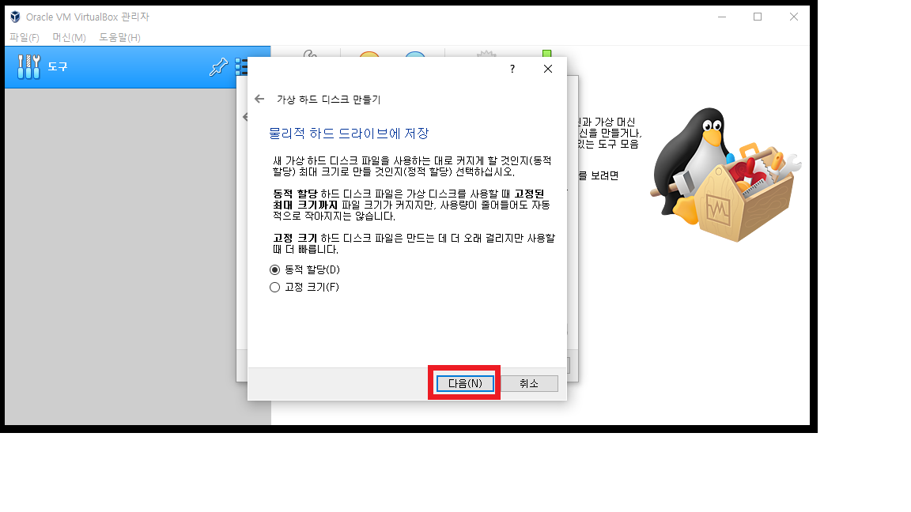

# CentOS 7 part 1 공부 과정

## 개요
리눅스 CentOS 7 제대로 배우기 의 강의를 들으며... 나온 자료를 정리
또는 README.md를 활용적으로 사용하기 위한 연습겸 리눅스 정리하는 페이지
[2021-09-14] ~ [ongoing]

## 운영체제의 개념
* 컴퓨터 시스템이 제공하는 모든 H/W 와 S/W 기능을 사용할 수 있도록 해주는 가장 중요한 시스템 소프트웨어
* 한정된 시스템 자원(resource)을 효율적으로 사용할 수 있도록 관리 및 운영함으로써 사용자에게 최대한의 편리성 제공
* 컴퓨터 시스템과 사용자간의 인터페이스(interface) 기능을 담당하는 시스템 프로그램
* 운영체제의 주목적은 사용자가 컴퓨터 시스템을 편리하게 사용하는데 있다.
* 부수적인 목적은 사용자 대신 컴퓨터 시스템(=하드웨어)을 효율적으로 사용하는데 있다.
* 운영체제는 자원의 관리자와 중재자의 역할 수행
    * 입출력 장치 관리
    * 중앙 처리 장치 관리
    * 기억 장치 관리
    * 파일 시스템 관리
* 한정된 시스템 자원을 원활하게 사용할 수 있도록 해주는 맨- 머신 인터페이스(man-machine interface)

* 중앙처리장치관리 : CPU
* 기억장치관리 : REM
* 입출력장치관리 : 마우스,키보드,프린터,모니터, 등등..
* 파일시스템관리 : HDD , SDD

## 운영체제의 목적
* 사용자 측면
    * 컴퓨터 H/W 와 S/W 를 최대한 편리하게 사용 할 수 있도록 함.
* 시스템 측면
    * 컴퓨터 시스템의 성능을 최적화하여 생산성을 향상시킨다.
* 운영체제의 설계
    * 시스템 성능 측면과 사용자 편의성 측면을 모두 고려하여 적절하게 설계

## 운영체제의 기능
* 자원 관리
* 메모리 관리
* 보조기억장치 관리
* 프로세스 관리
* 장치 관리(입출력 관리)
* 파일 관리

## 리눅스의 기초
* 리눅스의 출현 배경
    * 핀란드 헬싱키대학교의 학생이었던 리누스 베네딕트 토르발스(Linus Benedict Torvals)가 처음 개발
    * 미닉스(MINIX)라는 교육용 운영체제를 참조하여 개발
    * 리눅스 개발 소식을 comp.os.minix 뉴스 그룹에 포스팅: 1991년 8월 26일 -> 리눅스 탄생일

* 리눅스의 발전 과정
    * 최초 공개된 리눅스 커널 : 버전 0.01
    * GUN 프로젝트 : 리눅스 커널에 응용 프로그램 제공 -> GNU/리눅스
    * 리눅스 재단 : 2007년 설립
        * 리누스 토발라스 지원
        * 마이크로소프트, 오라클, AT&T, 퀄컴, 시스코, 후지쯔, 화웨이, 인텔, 삼성전자, IBM 등
        * 두세 달 간격으로 업데이트 버전이 배포
        * 리눅스 커널 아카이브(www.kernel.org)에서 누구나 소스와 패치를 내려 받을 수 있다. 

* GNU 프로젝트  
    * 리처드 스톨먼이 시작
    * 1985sus <GNU 선언문> 발표 및 자유소프트웨어재단(Free Software Foundation , FSF)을 설립
        * <GNU 선언문>은 http://www.gnu.org/gnu/manifesto.html에서 확인
    * GNU는 유닉스와 호환되는 자유 포스트웨어를 개발하는 프로젝트   
        * GNU is Not Unix(GNU는 유닉스가 아니다)의 약자로 '그누'라고 읽는다.
    * GNU는 다음과 같은 네 가지 자유를 보장(www.gnu.org)
        * 프로그램을 어떠한 목적으로도 실행할 수 있는 자유를
        * 프로그램이 어떻게 동작하는지 학습하고, 자신의 필요에 맞게 개작할 수 있는 자유. 이를 위해서는 소스코드에 대한 접근이 전제되어야 한다.
        * 이웃을 도울 수 있도록 복제물을 재배포할 수 있는 자유.
        * 프로그램을 개선할 수 있는 자유와 개선된 이점을 공동체 전체가 누릴 수 있도록 발표할 자유. 이를 위해서도 역시 소스코드에 대한 접근이 전제되어야 한다.
    * 1989년에 GPL(GNU General Public License) 제정 : 자유 소프트웨어 라이선스
        * 버전1(GPLv1), 버전2(GPLv2), 버전3(GPLv3) http://www.gnu.org/licenses/licenses.html 참조
        * GPLv1 : 1989년 1월에 발표, 이에 근거하여 프로그램을 배포할 때는 이해하기 쉬운 소스코드를 같이 배포해야 한다는 조건. GPLv1 프로그램을 수정한 프로그램은 원래 프로그램과 마찬가지로 GPLv1을 따라야 한다.
        * GPLv2 : 1991년 6월에 발표, GPL 라이선스 프로그램을 배포하는 것을 막는 조건
        * GPLv3 : 2007년 6월에 발표, 소프트웨어 특허에 대한 대체, 다른 라이선스와의 호환성, 디지털 저작권 관리에 관한 내용이 포함되어 있다.

* 리눅스와 유닉스
    * 리눅스는 유닉스 계열의 운영체제는
    * 리눅스 = 리누스 + 유닉스
    * 유닉스
        * 1969년 AT&T의 벨 연구소에서 어셈블리어로 처음 개발
        * 1971년에 C언어로 재개발 -> 최초의 고급 프로그래밍 언어로 작성한 운영체제로 이식성이 높다.
        * AT&T의 상용 유닉스와 오픈소스 버전인 BSD로 나뉘어 발전
        * BSD는 AT&T의 라이선스가 필요 없는 FreeBSD로 발전

* 리눅스 배포판
    * 리눅스 커널 + 응용프로그램으로 구성
    * 리눅스 배포판 :
        * 레드햇 계열
        * 데비안 계열
        * 슬랙웨어 계열

* 리눅스의 특징
    * 리눅스는 공개 소프트웨어이며 무료로 사용할 수 있다.
    * 유닉스와의 완벽한 호환성을 유지한다.
    * 서버용 운영체제로 많이 사용된다.
    * 편리한 GUI 환경을 제공한다.

* 리눅스의 구조
    * 커널 : 리눅스의 핵심
        * 프로세스/메모리/파일시스템/장치관리
        * 컴퓨터의 모든 자원 초기화 및 제어 기능
    * 셸 : 사용자 인터페이스    
        * 명령해석
        * 프로그래밍 기능
        * 리눅스 기본 셸 : 배시 셸(리눅스 셸)
    * 응용 프로그램 
        * 각종 프로그래밍 개발도구
        * 문서 편집 도구
        * 네트워크 관련 도구 등

## 리눅스 실습 환경 구축
* 가상머신
    * PC에 설치되어 있는 운영체제(호스트 OS)에 가상의 머신(시스템)을 생성한 후 여기에 다른 운영체제(게스트 OS)를 설치할 수 있도록 해주는 응용 프로그램

    |가상머신|호스트OS|게스트OS|
    |:------:   |:---|:---:|
    |VMware|윈도계열 운영체제, 대부분의 리눅스, 애플 맥|윈도 계열 운영체제, 대부분의 리눅스 배포판, 솔라리스, Mac OS|
    |버추얼 PC|윈도 계열 운영체제|윈도 계열 운영체제, 일부 리눅스, 솔라리스|
    |버추얼 박스|윈도 계열 운영체제, 대부분의 리눅스, 애플 맥, 솔라리스 |윈도 계열 운영체제, 대부분의 리눅스 배포판, 솔라리스, Mac OS, OpenBSD|

* 버추얼 박스 설치하기
    * https://www.virtualbox.or 로 이동하여 해당 OS에 맞는 버전 설치하기
    * 필자는 게스트OS가 window이므로 window 버전으로 설치를 하였습니다.

* CentOS 디스크 잡기 (게스트OS)
    * CentOS 7버전 x86_64 클릭
    * 미러링 서버 중 하나 선택
    * CentOS-7-x86_64-DVD-2009.iso 형식 클릭 해서 다운로드
    <b>새로 만들기</b>
    
    <b>가상 머신 만들기</b>
    
    <b>메모리 크기 할당하기</b>
    
    <b>가상하드 디스크 만들기</b>
    
    
    
    

* CentOS 설정하기
    * CentOS에 맞는 디스크를 설정한 후
    * 다운로드 받은 OS를 설정해야합니다.
    
    >    * asd
    >    * asd
    * asd
    
    
    