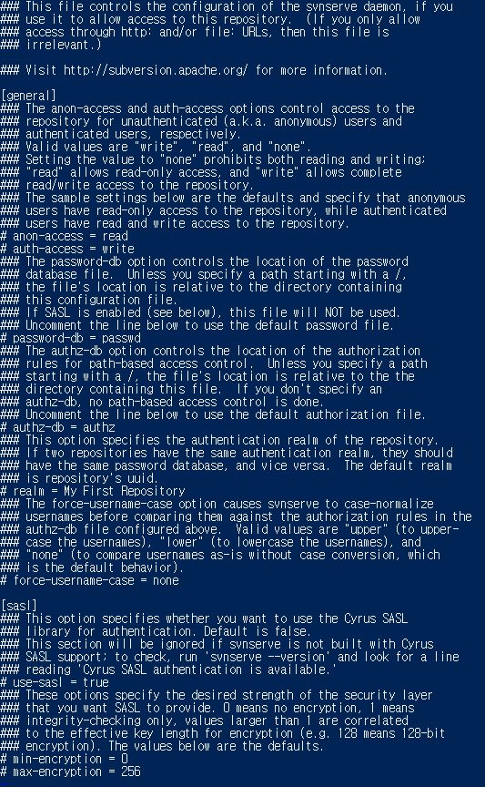
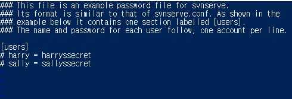
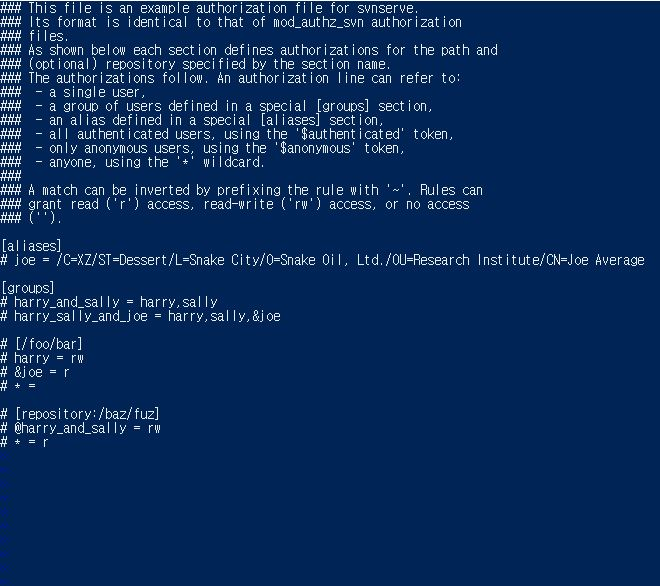

# subversion

## 개요
Linux 환경에서 처음으로 설정하는 svn 설치와 적용 방법을 정리하는 페이지


## 과정
* svn 설치 
* svn 저장소 생성 및 설정 
* svn 상세 사용 방법

### svn 설치
1. CentOS 7 Subversion 설치(yum 리스트 우선 확인)
```shell
yum list subversion
```


2. subversion 설치
```shell
yum install -y subversion
```

3. svn 환경변수 추가
```shell
vi /etc/profile

#svn_path
SVN_EDITOR=/usr/bin/vi
export SVN_EDITOR
```

<hr>

### svn 저장소 생성 및 설정

1. svn의 저장소들을 저장할 폴더 생성 및 설정
```shell
mkdir /app/svn
```

2. svn의 저장소를 생성
```shell
svnadmin create --fs-type fsfs 저장소명
```    

3. 생성된 저장소의 svnserve.conf 파일 수정
```shell
vi svnserve.conf
```         

* anon-access : 로그인 하지 않은 사용자(비인증 계정)에게 접근권한을 설정하는 부분 read , write , none 세가지 값을 설정 할 수 있다.
* auth-access : 로그인한 사용자(인증 계정)에 대한 접근 권한을 설정하는 부분 read , write , none 세가지 값을 설정 할 수 있다.
* passwd-db : 저장소에 접근할 사용자 계정과 비밀번호를 관리할 파일의 이름을 지정하는 설정이다. 기본 파일명은 passwd 이며, 다른 이름을 사용할 수 있다.
* authz-db : 파일과 디렉토리에 대한 접근 권한을 관리하는 파일의 이름을 지정하는 설정이다. 기본 파일명은 authz 이며, 다른 이름을 사용 할 수 있다.
* realm : 인증할 때 보여주는 간단한 저장소 설명이며, 생략 가능하다.
* none : 접근 권한 없음 , read : 읽기 권한 , write : 쓰기 권한

4. 생성된 저장소의 기본 passwd로 계정 정보 추가
```shell
vi passwd
```

>   하단에 입력
>   svn_id = svn_password

5. 생성된 저장소의 기본 authz로 접근할 계정정보 추가하여
```shell
vi authz
```

>   하단에 입력
```shell
[/]
* = r   #생성된 저장소의 루트경로에 모든 사용자가 read 할수 있는 권한을 부여
svn_id = rw #생성된 저장소의 루트경로에 svn_id 계정은 read , write 권한을 부여
```

6. 생성된 저장소 확인
```shell
svn list svn://localhost 또는 ip / 저장소명
svn info svn://localhost 또는 ip / 저장소명
```
svn 인증확인에 실패했다면 , svnserve.conf , passwd , authz 설정 부분 재확인

<hr>


### svn 상세 사용방법
1. 생성된 저장소에 디렉토리 만들기
```shell
svn mkdir svn://localhost 또는 ip/저장소명/생성할 디렉토리명
```

2. 생성된 저장소에 import 하는 방법
```shell
svn import 저장할 데이터 svn://localhost 또는 ip/저장소명
```
>   업로드할 디렉토리일경우 /test (폴더 전체를) 
>   업로드할 파일일경우 /test.html

3. svn 체크아웃 받는 방법
```shell
svn check --username name --password 1234 svn://localhost 또는 ip/저장소명
```

4. svn update 하는 방법
```shell
svn update # 프로젝트 폴더로 이동하여 update 해야함
```